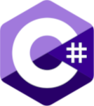

## About Me

Hi! I'm Velma and I'm a Computer Science Student and Software Developer.

I love Linux, and C++. I'm into Software Development Tools, Cybersecurity, and Web Development. I am proficient in C, C++, C#, and Java; with additional experience in TypeScript, JavaScript, HTML, CSS, Python, and MIPS Assembly.

I’m currently working on [pi_sage](https://github.com/thefool309/pi_Sage/) A network scanning tool for use with the Raspberry Pi.

## Contact Me

### [Public PGP Key](https://keys.openpgp.org/search?q=velmadev043@gmail.com)

<h4>If an email is not encrypted I put it on lower priority</h4>

## Skills and Proficiencies
<!--TODO: add logos for C#, and possibly Typescript??? IDK if I feel comfortable with typescript enough to say I know Typescript. I could definitely put C#-->
      

