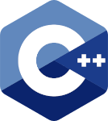

### About Me
Hi! I'm Velma(She/Her) and I'm a Computer Science Student and Software Developer.

I love Linux, and C++. I'm really into how software development tools are created and how they can make coding easier and more efficient.

I’m currently working on tutorials and documentation for TrueNAS to assist a friend of mine in compiling research for setting up their new system.

### Contact Me

  

### Skills and Proficiencies

     

### Stats

<!--
**thefool309/thefool309** is a ✨ _special_ ✨ repository because its `README.md` (this file) appears on your GitHub profile.

Here are some ideas to get you started:

- 🔭 I’m currently working on ...
- 🌱 I’m currently learning ...
- 👯 I’m looking to collaborate on ...
- 🤔 I’m looking for help with ...
- 💬 Ask me about ...
- 📫 How to reach me: ...
- 😄 Pronouns: ...
- ⚡ Fun fact: ...
-->
<!--

-->
